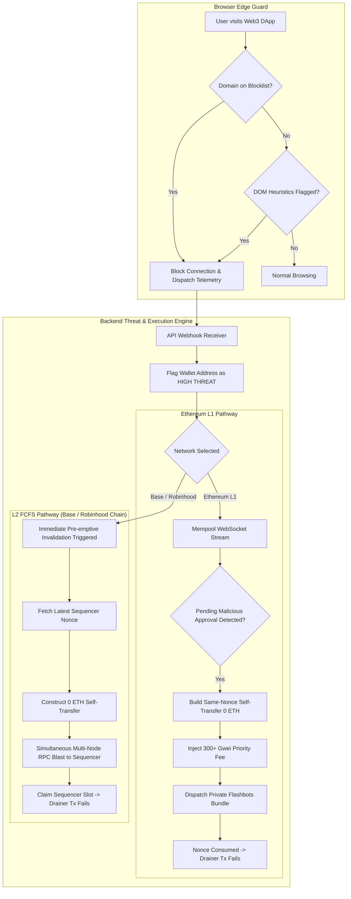

# Architecture Plan: Deprotector Ecosystem

## Executive Summary
**Deprotector** is a defensive phishing, approval-monitoring, and user-authorized revocation platform for Web3 wallets across configured EVM networks. It does not custody private keys or claim an automatic 98% neutralization rate.

---

## Complete Project Directory Map

```text
deprotector/
├── .gitignore                          # Standard project gitignore rules
├── GEMINI.md                           # Antigravity Workspace Rules
├── README.md                           # High-level architecture documentation
├── package.json                        # Monorepo root — workspaces: frontend/*
├── web-extension/                      # Module 1: Browser Shield (Manifest V3)
│   ├── manifest.json                   # Extension entry & permission manifest
│   ├── background/
│   │   └── service_worker.ts           # Background threat interceptor & RPC dispatcher
│   ├── content/
│   │   └── heuristics.ts               # DOM script analyzer & DaaS pattern detector
│   ├── rules/
│   │   └── blocklist.json              # Dynamic phishing domain registry
│   └── shared/
│       └── types.ts                    # Extension telemetry data interfaces
├── backend-engine/                     # Module 2 & 3: High-Speed Mempool & Flashbots Coordinator
│   ├── package.json                    # Backend dependencies & scripts
│   ├── tsconfig.json                   # TypeScript configuration
│   ├── .env.example                    # Environment variable template
│   └── src/
│       ├── index.ts                    # Core server entry & WebSocket listener bootstrap
│       ├── config/
│       │   └── networks.ts             # Network parameters (Ethereum, Base, Robinhood Chain)
│       ├── mempool/
│       │   ├── stream.ts               # Real-time WebSocket pending transaction subscriber
│       │   └── decoder.ts              # EVM call-data & selector parser (approve, setApprovalForAll)
│       ├── threat/
│       │   └── evaluator.ts            # High-threat state router & contract scoring
│       ├── execution/
│       │   ├── ethereum_mev.ts         # Ethereum L1 Flashbots bundle constructor
│       │   └── l2_sequencer_blaster.ts # Base & Robinhood Chain FCFS race-condition engine
│       └── api/
│           └── webhook.ts              # Web extension alert receiver endpoint
├── smart-contracts/                    # Module 4: Account Abstraction Guard (ERC-4337)
│   ├── package.json                    # Hardhat / Foundry contracts config
│   ├── contracts/
│   │   ├── GuardWallet.sol             # ERC-4337 Smart Account with Guardian Co-signer
│   │   └── interfaces/
│   │       └── IGuardWallet.sol        # Wallet interface specifications
│   └── test/
│       └── GuardWallet.test.ts         # Multi-sig co-signing unit tests
└── frontend/                           # All customer-facing web frontends (Vite workspace)
    └── landing/                        # Public marketing & landing page
        ├── index.html                  # Vite entry — DOM, SVG LUT filters, 3× video
        ├── package.json                # @deprotector/landing — vite ^5.4
        ├── vite.config.js              # Dev port 3000, build → dist/
        └── src/
            ├── style.css               # Canvas scaler, video layers, hero, stats, menu
            └── main.js                 # Video sync, mobile menu, WAAPI entrance animation
```

---

## Detailed Architectural Workflow



---

## Key Execution Milestones

| Milestone | Component | Description |
|---|---|---|
| **Phase 1** | **Backend Engine Core** | Real-time WebSocket mempool streamer, call-data decoder, and network configuration module. |
| **Phase 2** | **Ethereum MEV Frontrunner** | Flashbots private bundle builder with automated dynamic gas pricing and same-nonce invalidation. |
| **Phase 3** | **L2 Sequencer Blaster** | Queue-dominance pre-emptive invalidation engine tailored to Base and Robinhood Chain (Arbitrum Orbit). |
| **Phase 4** | **Browser Extension Shield** | Manifest V3 service worker, blocklist matching engine, DOM heuristics scanner, and webhook dispatcher. |
| **Phase 5** | **ERC-4337 Smart Wallet** | Account Abstraction contract with guardian co-signing and emergency balance-sweeping functions. |
